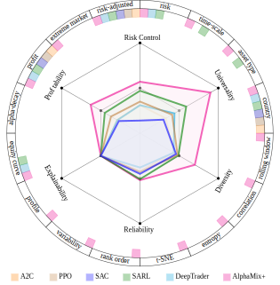
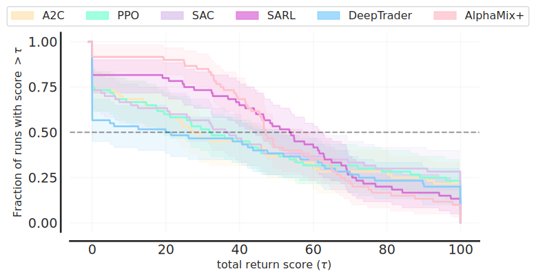
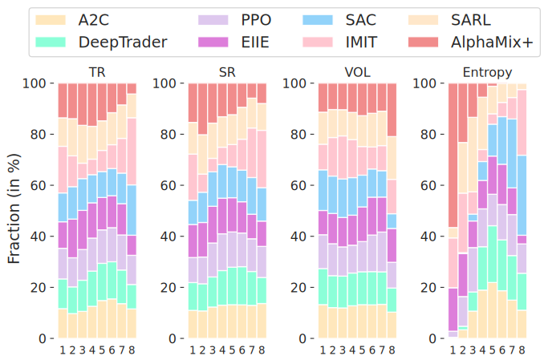

# PRUDEX-Compass
PRUDEX-Compass is the first attempt to create a systematic evaluation
of reinforcement learning in financial markets.

It has 6 axes with a total of 16 measures for systematic evaluation of FinRL methods.

Moreover, this repositories also includes the intergrated result on 4 datasets, including one novel method: AlphaMix+, a strong FinRL baseline which leverages Mixture-of-Experts (MoE) and risk-sensitive approaches to make diversified risk-aware investment decisions.
## Compass
The `PRUDEX-Compass` provides support for 
- A systematic evaluation from 6 axes 
<div align="center">
  
</div>
<!-- {width=65%} -->

<!-- {width=100% height=400} -->

And here is the file structure for `Final compass`
```
|-- Finall compass
|   |-- blank.tex
|   |-- example.tex
|   |-- main.tex

```
Here we provide a [blank tex](https://github.com/ai-gamer/PRUDEX-Compass/blob/main/Compass/generate/Finall%20compass/blank.tex) that you can play with, the blank tex does not have any color block but the hexagon and the outer ring, while the [example tex](https://github.com/ai-gamer/PRUDEX-Compass/blob/main/Compass/generate/Finall%20compass/example.tex) generate the picture shown above. we can use the [main.tex](https://github.com/ai-gamer/PRUDEX-Compass/blob/main/Compass/generate/Finall%20compass/main.tex) to see it. You can also alter the config or the colors of the compass.

- A octagon to evaluate profitability,risk-control and diversity
<table>
    <tr>
        <td ><center>    (a)A2C   </center></td>
        <td ><center>    (b)PPO </center></td>
        <td ><center>    (c)SAC </center></td>
    </tr>
    <tr>
        <td ><center>     (d)SARL </center></td>
        <td ><center>    (e)DeepTrader </center></td>
        <td ><center>    (f)AlphaMix+ </center></td>
    </tr>
</table>


<div STYLE="page-break-after: always;"></div>

And here is the file structure for `octagon`
```
-- ocatgon
    |-- A2C.tex
    |-- Alphamix+.tex
    |-- DeepTrader.tex
    |-- PPO.tex
    |-- SAC.tex
    |-- SARL.tex
    |-- blank.tex
```
Here we provide a [blank tex](https://github.com/ai-gamer/PRUDEX-Compass/blob/main/Compass/generate/ocatgon/blank.tex) that you can play with, the blank tex does not have any color block but the hexagon and the outer ring, while the rest of tex generate the subpicture corresponding to the  shown above. You can also manipulate the color and the value for different algorithms to generate graphs.

- A graph discribing the dirstribution of the score of different algorithms
<div align="center">
  
</div>

The key is to generate a dictionary whose key is the name of algorithms and the value is 2d array which represents different seeds and different task, then with the dictionary naming `overall_dict`, we can simpily use the code
```
colors = ['moccasin','aquamarine','#dbc2ec','orchid','lightskyblue','pink','orange']
xlabels = ['A2C','PPO','SAC','SARL','DeepTrader',"AlphaMix+"]
color_idxs = [0, 1,2,3,4,5,6]
ATARI_100K_COLOR_DICT = dict(zip(xlabels, [colors[idx] for idx in color_idxs]))
from scipy.stats.stats import find_repeats
#@title Calculate score distributions and average score distributions for for Atari 100k

algorithms = ['A2C','PPO','SAC','SARL','DeepTrader',"AlphaMix+"]

score_dict = {key: overall_dict[key][:] for key in algorithms}
ATARI_100K_TAU = np.linspace(-1, 100,1000)
# Higher value of reps corresponds to more accurate estimates but are slower
# to computed. `reps` corresponds to number of bootstrap resamples.
reps = 2000

score_distributions, score_distributions_cis = rly.create_performance_profile(
    score_dict, ATARI_100K_TAU, reps=reps)

fig, ax = plt.subplots(ncols=1, figsize=(8.0, 4.0))

plot_utils.plot_performance_profiles(
  score_distributions, ATARI_100K_TAU,
  performance_profile_cis=score_distributions_cis,
  colors=ATARI_100K_COLOR_DICT,
  xlabel=r'total return score $(\tau)$',
  labelsize='xx-large',
  ax=ax)

ax.axhline(0.5, ls='--', color='k', alpha=0.4)
fake_patches = [mpatches.Patch(color=ATARI_100K_COLOR_DICT[alg], 
                               alpha=0.75) for alg in algorithms]
legend = fig.legend(fake_patches, algorithms, loc='upper center', 
                    fancybox=True, ncol=len(algorithms), 
                    fontsize='small',
                    bbox_to_anchor=(0.5, 0.9,0,0))
plt.savefig("./distribution.pdf",bbox_inches = 'tight')
```
to generate the distribution. Notice that we only use one dicator (total return in the example) to demonstrate the graph, which is a little different from what we have next(rank information).

For more precise informatino, please refer to [`Compass/generate/distribution/distribution.py`](https://github.com/ai-gamer/PRUDEX-Compass/blob/main/Compass/generate/distribution/distribution.py)

- A graph discribing the rank informatino for different algorithms
<div align="center">
  

</div> 


The key is to generate a dictionary whose key is the name of indicator and the value is dictionary similar to what we have in the distribution. Then we can simpliy use the code
```
from Compass.generate.rank.rank import subsample_scores_mat,get_rank_matrix,make_rank_plot
dmc_scores = {}
dmc_scores["TR"]=tt_dict
dmc_scores["SR"]=sr_dict
dmc_scores["CR"]=cr_dict
dmc_scores["SoR"]=sor_dict
dmc_scores["VOL"]=vol_dict
dmc_scores["Entropy"]=Entropy_dict
indicator_list=['TR','SR','VOL','Entropy']
algs=['A2C','PPO','SAC','SARL','DeepTrader','AlphaMix+']
colors=['moccasin','aquamarine','#dbc2ec','salmon','lightskyblue','pink','orange']
make_rank_plot(algs,indicator_list,".rank.pdf",colors)
```
to generate the graph.

For more information, please refer to [`rank.py`](https://github.com/ai-gamer/PRUDEX-Compass/blob/main/Compass/generate/rank/rank.py)
## AlphaMix+
AlphaMix+, a universal RL framework with diversified risk-aware Mixture-of-Experts(MoE) for quantitative trading.

We implement it through using RLkit and here is how you can choose your dataset and tune the parameters, train valid and test.
Here is the sctructure of the AlphaMix+.
```
-- PM
    |-- LICENSE
    |-- README.md
    |-- data
    |-- environment
    |-- finrl
    |-- mbbl
    |-- rl_env
    |-- rlkit
    |-- sac_gym.py
    |-- scripts
    |-- setup.py
    |-- sunrise_gym.py
    `-- sunrise_pm_sz50.py

```

### Example
Here we use the sz50 dataset as an example to show you how we can use it.
We can directly open the [`sunrise_pm_sz50.py`](https://github.com/ai-gamer/PRUDEX-Compass/blob/main/AlphaMix%2B/PM/sunrise_pm_sz50.py) under [`PM`](https://github.com/ai-gamer/PRUDEX-Compass/tree/main/AlphaMix%2B/PM).You can dierctly run it or run it on the `bash` using 
```
python ./sunrise_pm_sz50.py --dataset sz50 --num_layer 4
```
or any paramaters you want to change which is defined in the `parse_args` function.

After traning, it will store the result under [`data`](https://github.com/ai-gamer/PRUDEX-Compass/tree/main/AlphaMix%2B/PM/data) whose structure is like
```
|-- crypto
|-- foreign_exchange
|-- portfolio_management
|   |-- sunrise-pm
|       |-- sz50
|       |   `-- en_3_batch_256_plr_0.0007_qlr_0.0007_layer_128_2_buffer_10000_discount_0.99_tem_20_bm_0.5_uncertain_0.5
|       |       |-- seed_12345
|       |       |   |-- debug.log
|       |       |   |-- progress.csv
|       |       |   |-- result.csv
|       |       |   |-- test_daily_action_0.npy
|       |       |   |-- test_daily_action_1.npy
|       |       |   |-- ...
|       |       |   |-- test_daily_return_0.csv
|       |       |   |-- test_daily_return_1.csv
|       |       |   |-- ...
|       |       |   `-- variant.json
|       |       |-- ...
|       |       |-- sz50.ipynb
|-- sz50

```
Under the [`portfolio_management/sunrise-pm`](https://github.com/ai-gamer/PRUDEX-Compass/tree/main/AlphaMix%2B/PM/data/portfolio_management/sunrise-pm), we can get the the name of our dataset under which lies the the name of model indicating its super-parameters under which lies the result for different seed which contains the overall result on the valid and test dataset in [`result.csv`](https://github.com/ai-gamer/PRUDEX-Compass/blob/main/AlphaMix%2B/PM/data/portfolio_management/sunrise-pm/sz50/en_3_batch_256_plr_0.0007_qlr_0.0007_layer_128_2_buffer_10000_discount_0.99_tem_20_bm_0.5_uncertain_0.5/seed_12345/result.csv) and more specifically, action and daily return for each epoch on the test set in [`test_daily_action_(number of epoch).npy`](https://github.com/ai-gamer/PRUDEX-Compass/blob/main/AlphaMix%2B/PM/data/portfolio_management/sunrise-pm/sz50/en_3_batch_256_plr_0.0007_qlr_0.0007_layer_128_2_buffer_10000_discount_0.99_tem_20_bm_0.5_uncertain_0.5/seed_12345/test_daily_action_0.npy) and [`test_daily_return_(number of epoch).csv`](https://github.com/ai-gamer/PRUDEX-Compass/blob/main/AlphaMix%2B/PM/data/portfolio_management/sunrise-pm/sz50/en_3_batch_256_plr_0.0007_qlr_0.0007_layer_128_2_buffer_10000_discount_0.99_tem_20_bm_0.5_uncertain_0.5/seed_12345/test_daily_return_0.csv).

For users to pick the best model, we also add a [`sz50.ipynb`](https://github.com/ai-gamer/PRUDEX-Compass/blob/main/AlphaMix%2B/PM/data/portfolio_management/sunrise-pm/sz50.ipynb) in the example which help pick the best model, calculate a series of financial indicators, and summrize the result.

