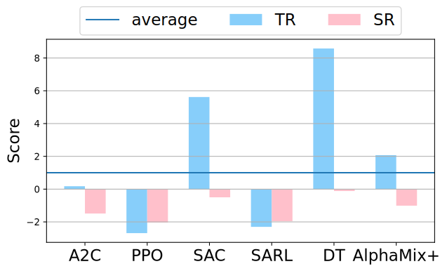

# PRUDEX-Compass
PRUDEX-Compass is designed for systematic evaluation of FinRL methods with 6 axes and 16 measures.

<div align="center">
  
</div>

## Install
To install the dependency of `PRUDEX-Compass`, run the command:
```
pip install -r requirements.txt
```


## Creating PRUDEX-Compass Using the Python Script

You can use the [`create_compass.py`](https://github.com/ai-gamer/PRUDEX-Compass/blob/main/Compass/generate/compass/create_compass.py) python script to generate a compass and specify how it is filled for each FinRL method in a JSON file:
```
$ python Compass/generate/compass/create_compass.py --h
usage: create_compass.py [-h] [--template TEMPLATE] [--output OUTPUT] [--data DATA]

CLEVA-Compass Generator.

optional arguments:
  -h, --help           show this help message and exit
  --template TEMPLATE  Tikz template file. (default: Compass/generate/compass/blank.tex)
  --output OUTPUT      Tikz filled output file. (default: Compass/generate/compass/filled.tex)
  --data DATA          Entries as JSON file. (default: Compass/generate/compass/data.json)
```
For this purpose we provide the blank file [`blank.tex`](https://github.com/ai-gamer/PRUDEX-Compass/blob/main/Compass/generate/compass/blank.tex).
<div align="center">
  
</div>

## Example Usage 
The default reads the template file from [`blank.tex`](https://github.com/ai-gamer/PRUDEX-Compass/blob/main/Compass/generate/compass/blank.tex) and writes the filled output file into [`filled.tex`](https://github.com/ai-gamer/PRUDEX-Compass/blob/main/Compass/generate/compass/filled.tex) with the data specified via --data <JSON_FILE>:
```
$ python Compass/generate/compass/create_compass.py--data Compass/generate/compass/data.json
```
A example CLEVA-Compass, generated with [`Compass/generate/compass/data.json`](https://github.com/ai-gamer/PRUDEX-Compass/blob/main/Compass/generate/compass/data.json).

<div align="center">
  
</div>

## JSON Data Format
The JSON file specifies a list of entries, where each element defines a `color`, `label`, `inner_level`, and `outer_level`. The latter two specify the attributes visualized in the compass.

`color`: Can be one of `["magenta", "green", "blue", "orange", "cyan", "brown"]`.

`label`: A label describing the compass entry.

`inner_level`: Specifies the inner compass level attributes. Attribute values must be between 1 and 100.

`outer_level`: Specifies the outer compass level attributes. Attribute values must boolean `(true/false)`.

Here a json file is given as an example:
```
{"entries": [{
       "color": "orange",
       "label": "A2C",
       "inner_level": {
          "Proftability": 29,
          "Risk_Control": 31,
          "University": 33,
          "Diversity": 43,
          "Reliability": 42,
          "Explainability": 50
        },
       "outer_level": {
          "alpha_decay": false,
          "profit": true,
          "extreme_market": false,
          "risk_adjusted": true,
          "risk": false,
          "time_scale": false,
          "assert_type": false,
          "country": true,
          "rolling_window": false,
          "correlation": false,
          "entropy": false,
          "t_SNE": false,
          "rank_order": false,
          "variability": false,
          "profile": false,
          "equity_curve": false  }}]}
```
and a more complicated example can be found in [`Compass/generate/compass/data.json`](https://github.com/ai-gamer/PRUDEX-Compass/blob/main/Compass/generate/compass/data.json)

The resulting file [`filled.tex`](https://github.com/ai-gamer/PRUDEX-Compass/blob/main/Compass/generate/compass/filled.tex) can then be included into any LaTeX document, e.g.:
```
\begin{figure}
    \input{filled.tex}
    \caption{PRUDEX-Compass}
\end{figure}
```

## PRIDE-Star
- The PRIDE-Star is used to evaluate profitability,risk-control and diversity
<table align="center">
    <tr>
        <td ><center>   </center></td>
        <td ><center> </center></td>
        <td ><center> </center></td>
    </tr>
    <tr>
     <td align="center"><center>(a) A2C</center></td><td align="center"><center>(b) PPO</center></td>      <td align="center"><center>(c) SAC</center></td>                   
    </tr>
    <tr>
        <td ><center> </center></td>
        <td ><center> </center></td>
        <td ><center>  </center></td>
    </tr>
    <tr>
     <td align="center"><center>(d) SARL</center></td><td align="center"><center>(e) DeepTrader</center></td>      <td align="center"><center>(f) AlphaMix+</center></td>                   
    </tr>
</table>


<div STYLE="page-break-after: always;"></div>

And here is the file structure for `PRIDE-Star`
```
-- PRIDE-Star 
    |-- A2C.tex
    |-- Alphamix+.tex
    |-- DeepTrader.tex
    |-- PPO.tex
    |-- SAC.tex
    |-- SARL.tex
    |-- blank.tex
```
Here we provide a [blank tex](https://github.com/ai-gamer/PRUDEX-Compass/blob/main/Compass/generate/PRIDE-Star/blank.tex) that you can play with, the blank tex does not have any color block but the hexagon and the outer ring, while the rest of tex generate the subpicture corresponding to the  shown above. You can also manipulate the color and the value for different algorithms to generate graphs.

## Performance Profile
- The performance profile reports FinRL methods' score distribution of all runs across the differentfinancial markets that are statistically unbiased and more robust to outliers.
<div align="center">
  
</div>

The key is to generate a dictionary whose key is the name of algorithms and the value is 2d array which represents different seeds and different task, then with the dictionary naming `overall_dict`, we can simpily use the code
```
import numpy as np
import pandas as pd
import matplotlib.pyplot as plt
import scipy.stats
from rliable import library as rly
from rliable import metrics
from rliable import plot_utils
import seaborn as sns
sns.set_style("white")
import matplotlib.patches as mpatches
import collections
import os
from Compass.distribution.distribution import make_distribution_plot
colors = ['moccasin','aquamarine','#dbc2ec','orchid','lightskyblue','pink','orange']
xlabels = ['A2C','PPO','SAC','SARL','DeepTrader',"AlphaMix+"]
color_idxs = [0, 1,2,3,4,5,6]
ATARI_100K_COLOR_DICT = dict(zip(xlabels, [colors[idx] for idx in color_idxs]))
from scipy.stats.stats import find_repeats
xlabel=r'total return score $(\tau)$',
dict=tt_dict_crypto
algorithms = ['A2C','PPO','SAC','SARL','DeepTrader',"AlphaMix+"]
make_distribution_plot(dict,algorithms,2000,xlabel,"./distribution",ATARI_100K_COLOR_DICT)
```
to generate the distribution. Notice that we only use one metrics (total return in the example) to demonstrate the graph.

For more precise information, please refer to [`Compass/generate/distribution/distribution.py`](https://github.com/ai-gamer/PRUDEX-Compass/blob/main/Compass/generate/distribution/distribution.py)

## Rank Distribution
- The rank distribution plot is a bar plot, where the i-th column in the rank distribution shows the probability
that a given method is assigned rank i in the corresponding metrics.
<div align="center">
  

</div> 


The key is to generate a dictionary whose key is the name of indicator and the value is dictionary similar to what we have in the distribution. Then we can simpliy use the code
```
from Compass.generate.rank.rank import subsample_scores_mat,get_rank_matrix,make_rank_plot
dmc_scores = {}
dmc_scores["TR"]=tt_dict
dmc_scores["SR"]=sr_dict
dmc_scores["CR"]=cr_dict
dmc_scores["SoR"]=sor_dict
dmc_scores["VOL"]=vol_dict
dmc_scores["Entropy"]=Entropy_dict
indicator_list=['TR','SR','VOL','Entropy']
algs=['A2C','PPO','SAC','SARL','DeepTrader','AlphaMix+']
colors=['moccasin','aquamarine','#dbc2ec','salmon','lightskyblue','pink','orange']
make_rank_plot(algs,indicator_list,".rank.pdf",colors)
```
to generate the graph.

For more information, please refer to [`rank.py`](https://github.com/ai-gamer/PRUDEX-Compass/blob/main/Compass/generate/rank/rank.py)
## Performance under Extreme Markets
- The performance under extreme markets is also a bar plot, which reflects FinRL methods' ability to deal with black swan events in terms of total return and sharpe ratio compared with uniform policy.
<div align="center">
  
</div> 
The key is to select a volatile period and get the daily return rate . Then we can simpliy use the code

```
from Compass.generate.exen.exen import evaualte,plot_pictures
A2C=pd.read_csv("./A2C.csv",index_col=0)
SARL=pd.read_csv("./SARL.csv",index_col=0)
DeepTrader=pd.read_csv("./DeepTrader.csv",index_col=0)
PPO=pd.read_csv("./PPO.csv",index_col=0)
SAC=pd.read_csv("./SAC.csv",index_col=0)
AlphaMix=pd.read_csv("AlphaMix+.csv",index_col=0)
path=".exen.pdf"
plot_pictures(new_models,path)
```

to generate the graph.
## AlphaMix+
AlphaMix+, a universal RL framework with diversified risk-aware Mixture-of-Experts(MoE) for quantitative trading.

We implement it through using RLkit and here is how you can choose your dataset and tune the parameters, train valid and test.
Here is the sctructure of the AlphaMix+.
```
-- PM
    |-- LICENSE
    |-- README.md
    |-- data
    |-- environment
    |-- finrl
    |-- mbbl
    |-- rl_env
    |-- rlkit
    |-- sac_gym.py
    |-- scripts
    |-- AlphaMix+_sz50.py
    |-- setup.py


    
```

### Example
Here we use the sz50 dataset as an example to show you how we can use it.
We can directly open the [`sunrise_pm_sz50.py`](https://github.com/ai-gamer/PRUDEX-Compass/blob/main/AlphaMix%2B/PM/sunrise_pm_sz50.py) under [`PM`](https://github.com/ai-gamer/PRUDEX-Compass/tree/main/AlphaMix%2B/PM).You can dierctly run it or run it on the `bash` using 
```
python ./AlphaMix+_sz50.py --dataset sz50 --num_layer 4
```
or any paramaters you want to change which is defined in the `parse_args` function.

After traning, it will store the result under [`data`](https://github.com/ai-gamer/PRUDEX-Compass/tree/main/AlphaMix%2B/PM/data) whose structure is like
```
|-- crypto
|-- foreign_exchange
|-- portfolio_management
|   |-- AlphaMix+
|       |-- sz50
|       |   `-- en_3_batch_256_plr_0.0007_qlr_0.0007_layer_128_2_buffer_10000_discount_0.99_tem_20_bm_0.5_uncertain_0.5
|       |       |-- seed_12345
|       |       |   |-- debug.log
|       |       |   |-- progress.csv
|       |       |   |-- result.csv
|       |       |   |-- test_daily_action_0.npy
|       |       |   |-- test_daily_action_1.npy
|       |       |   |-- ...
|       |       |   |-- test_daily_return_0.csv
|       |       |   |-- test_daily_return_1.csv
|       |       |   |-- ...
|       |       |   `-- variant.json
|       |       |-- ...
|       |       |-- sz50.ipynb
|-- sz50

```
Under the [`portfolio_management/AlphaMix+`](https://github.com/ai-gamer/PRUDEX-Compass/tree/main/AlphaMix%2B/PM/data/portfolio_management/AlphaMix%2B), we can get the the name of our dataset under which lies the the name of model indicating its super-parameters under which lies the result for different seed which contains the overall result on the valid and test dataset in [`result.csv`](https://github.com/ai-gamer/PRUDEX-Compass/blob/main/AlphaMix%2B/PM/data/portfolio_management/AlphaMix%2B/sz50/en_3_batch_256_plr_0.0007_qlr_0.0007_layer_128_2_buffer_10000_discount_0.99_tem_20_bm_0.5_uncertain_0.5/seed_12345/result.csv) and more specifically, action and daily return for each epoch on the test set in [`test_daily_action_(number of epoch).npy`](https://github.com/ai-gamer/PRUDEX-Compass/blob/main/AlphaMix%2B/PM/data/portfolio_management/AlphaMix%2B/sz50/en_3_batch_256_plr_0.0007_qlr_0.0007_layer_128_2_buffer_10000_discount_0.99_tem_20_bm_0.5_uncertain_0.5/seed_12345/test_daily_action_0.npy) and [`test_daily_return_(number of epoch).csv`](https://github.com/ai-gamer/PRUDEX-Compass/blob/main/AlphaMix%2B/PM/data/portfolio_management/AlphaMix%2B/sz50/en_3_batch_256_plr_0.0007_qlr_0.0007_layer_128_2_buffer_10000_discount_0.99_tem_20_bm_0.5_uncertain_0.5/seed_12345/test_daily_return_0.csv).

For users to pick the best model, we also add a [`sz50.ipynb`](https://github.com/ai-gamer/PRUDEX-Compass/blob/main/AlphaMix%2B/PM/data/portfolio_management/AlphaMix%2B/sz50.ipynb) in the example which help pick the best model, calculate a series of financial indicators, and summrize the result.

